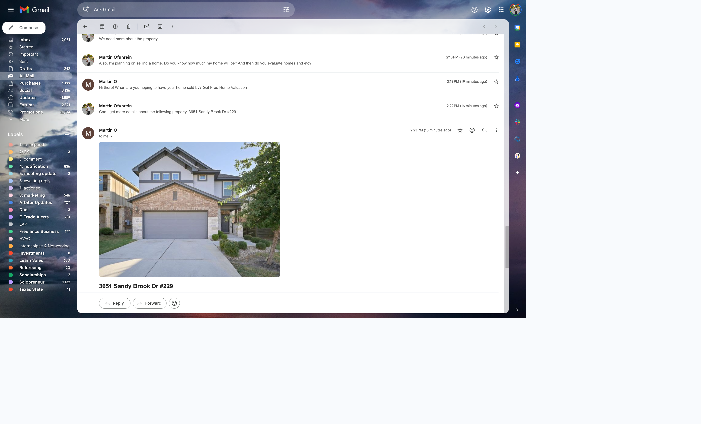
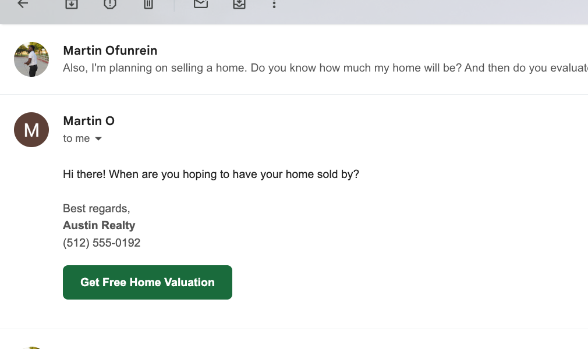

# Real Estate Email Agent

An AI-powered Gmail agent for real estate teams. Monitors your inbox, understands what each email is asking for, and sends a personalized reply within seconds — property details with photos, live Zillow search results, lead qualification, showing scheduling, and more.

Built for solo agents and small teams (1-20 agents). Each client gets their own deployed instance.

---

## Screenshots

**Live Zillow search results** — "show me 3-bed homes under $500k in Round Rock":


**Property detail reply** — photo, price, beds/baths/sqft, mortgage rates, Calendly button:



**Seller lead qualification** — asks one question + free home valuation CTA:



---

## What it does

| Email type | What happens |
|---|---|
| Single property inquiry | HTML reply with hero photo, price, beds/baths/sqft, mortgage rates, neighborhood stats, Calendly button, and optional similar homes block |
| Multi-property inquiry | Card-per-property reply with photos and details for all addresses |
| Property search (e.g. "3-bed under $500k in Round Rock") | Searches your sheet first, hits live Zillow if sheet has fewer than 3 matches, appends new results to sheet |
| Showing request | Reply with Calendly booking link |
| Buyer lead | Qualifies over up to 3 emails (budget, area, timeline) → HubSpot contact |
| Seller lead | Qualifies + sends free home valuation form link |
| Renter lead | Qualifies → routes to property manager if configured |
| Hot lead detected | Instant SMS to agent via Twilio |
| No reply in 3 days | Automatic day-3 follow-up email |
| No reply in 7 days | Final follow-up, then marked cold |
| Spam / complex | Labeled `NEEDS_HUMAN`, no reply sent |

All replies include a consistent signature and are sent as threaded replies to the original email.

---

## Data sources

| Source | Used for | Cost |
|---|---|---|
| Google Sheet | Your own active listings (primary cache) | Free |
| Zillow via Apify | Live property details + photos for any address | ~$0.002/lookup |
| Zillow search via Apify | Live inventory search by area/beds/price | ~$0.002/result |
| Zillow sold comps via Apify | Max 2 comps, only on explicit price/value questions | ~$0.006/trigger |
| RentCast | Rental value estimates | Free (50 req/month) |
| FRED API | Current 30yr/15yr mortgage rates | Free |
| Census ACS | Neighborhood median income by ZIP | Free |

New properties fetched from Zillow/RentCast are automatically appended to your Google Sheet so future inquiries hit the sheet cache at zero cost.

---

## Setup

### 1. Google Cloud — Gmail + Sheets OAuth

1. Go to [console.cloud.google.com](https://console.cloud.google.com) and create a project
2. Enable **Gmail API** and **Google Sheets API**
3. Configure OAuth consent screen → External → add your Gmail as a test user
4. Create **OAuth 2.0 Client ID** → **Desktop app** → Download JSON → save as `credentials.json`
5. Add `http://localhost:8080/` to Authorized redirect URIs

### 2. Google Sheet

Create a sheet with a tab named **`properties`**. Row 1 headers (exact order):

```
address | price | beds | baths | city | state | zip | description | neighborhood | property_type | features | days_on_market | photo_url | sqft | year_built | status | listing_url | agent_name | agent_email
```

Copy the Sheet ID from the URL: `https://docs.google.com/spreadsheets/d/<SHEET_ID>/edit`

### 3. API keys

| Service | Where to get it | Cost |
|---|---|---|
| Anthropic | [console.anthropic.com](https://console.anthropic.com) | Pay-per-use (~$0.01–0.05/email) |
| Apify | [console.apify.com](https://console.apify.com) → Settings → Integrations | Pay-per-use |
| HubSpot | App → Settings → Integrations → Private Apps | Free tier |
| Twilio | [console.twilio.com](https://console.twilio.com) | ~$0.008/SMS |
| RentCast | [app.rentcast.io](https://app.rentcast.io) | Free (50 req/month) |
| FRED | [fred.stlouisfed.org/docs/api/api_key.html](https://fred.stlouisfed.org/docs/api/api_key.html) | Free |
| Census | [api.census.gov/data/key_signup.html](https://api.census.gov/data/key_signup.html) | Free |
| Calendly | [calendly.com](https://calendly.com) | Free tier |

### 4. Install

```bash
git clone https://github.com/Ofunrein/real-estate-email-agent
cd real-estate-email-agent
pip install -r requirements.txt
cp .env.example .env
# Fill in .env with your keys
```

### 5. First run

```bash
python agent.py
```

A browser window opens for Gmail OAuth. Approve access — `token.json` is saved and re-auth is not needed again unless scopes change.

The agent only processes emails that arrive **after** first start. The startup timestamp is saved to `state.json`.

---

## Configuration

All config lives in `.env`. See [`.env.example`](.env.example) for the full reference.

Key variables:

```bash
TEAM_NAME=Austin Realty          # Used in replies and notifications
TEAM_LEAD_EMAIL=                 # Receives lead notifications + fallback routing
AGENT_PHONE=+1xxxxxxxxxx         # SMS destination for hot leads and Theo handoff alerts
POLL_INTERVAL_SECONDS=60         # How often to check for new emails
ENABLE_SIMILAR_HOMES=false       # Optional similar-home cards on single-property inquiry emails
ENABLE_SMS_AGENT=false           # Set true only after Twilio dry-run checks pass
TWILIO_ACCOUNT_SID=              # Required for Theo outbound SMS
TWILIO_AUTH_TOKEN=               # Required for Theo outbound SMS
TWILIO_FROM=+1xxxxxxxxxx         # Twilio sender number
TWILIO_MESSAGING_SERVICE_SID=    # Prefer for RCS-capable Messaging Service send/fallback
ENABLE_SMS_IMAGES=false          # Optional MMS property photos
SMS_IMAGE_MODE=on_request        # off | on_request | property_reply
SMS_MAX_IMAGES=3                 # Max one photo per requested property, capped at 3
THEO_ENRICHMENT_TIMEOUT_MS=14000 # Live data budget so SMS photo/detail lookups can return before reply
THEO_APIFY_TIMEOUT_SECONDS=12    # Keeps live SMS enrichment inside Twilio's webhook window
THEO_REPLY_DEBOUNCE_MS=2500      # Wait briefly to combine rapid-fire texts into one reply
GOOGLE_MAPS_API_KEY=             # Optional Street View fallback when Zillow photos are unavailable
```

**Agent routing:** Add `Agent Name` and `Agent Email` columns to your sheet. Inquiries about a specific listing are CC'd to that agent automatically.

---

## Agent Inbox V1

Agent Inbox is a read-only monitor for the shared Google Sheet workbook. It shows lead memory, conversation events, email threads, and basic metrics.

Prepare the workbook:

```bash
python3 scripts/setup_agent_inbox_sheets.py
```

Run the email agent:

```bash
python3 -m channels.iris_email
```

The legacy `python3 agent.py` entry point still works. Disable Iris with `ENABLE_EMAIL_AGENT=false`.

Run the local Python Agent Inbox debug viewer:

```bash
python3 -m agent_inbox.app
```

Open `http://127.0.0.1:8787`.

Run the Next.js Agent Inbox:

```bash
npm install
npm run dev
```

Open `http://127.0.0.1:3000`.

The dashboard polls `/api/data` every 5 seconds. Theo/Olivia webhook events usually appear on the next poll because they write to Neon during the inbound request. Iris email events appear after the Gmail poller records them; by default that means up to `POLL_INTERVAL_SECONDS` plus the next 5-second dashboard refresh. In Google Sheets-only mode, the dashboard cache is also 5 seconds.

For hosted/multi-client deployment, run the Postgres schema and sync Sheets into the database:

```bash
for migration in db/migrations/*.sql; do
  psql "$DATABASE_URL" -f "$migration"
done
npm run sync:sheets
```

Current sync contract: Google Sheets remains the editable source for manual property/config edits and `npm run sync:sheets` upserts those rows into Neon. Live Theo property lookups write to Neon and append missing properties back to the Sheet when possible. General Neon-to-Sheets editing is not automatic yet because the Sheet has no per-row `updated_at` or conflict marker; add that before enabling broad two-way overwrites.

See [docs/hosted-client-onboarding.md](/Users/martinofunrein/Downloads/real-estate-email-agent/docs/hosted-client-onboarding.md).

Neon bootstrap and GoHighLevel mirror:

```bash
npm run setup:neon
npm run sync:ghl
```

Hosted channel webhooks write to Neon and then appear in the dashboard:

| Channel | Agent | Webhook |
|---|---|---|
| SMS | Theo | `/api/webhooks/theo-sms` |
| WhatsApp | Theo | `/api/webhooks/theo-whatsapp` |
| Voice | Aria | `/api/webhooks/aria-voice` |
| Website chat | Olivia | `/api/webhooks/olivia-website` |

Set `CHANNEL_WEBHOOK_SECRET` to require `x-lumenosis-webhook-secret` or `?secret=` on inbound webhook calls. V1 behavior:

- Theo SMS logs inbound messages, updates shared memory, generates one safe reply, sends through Twilio only when `ENABLE_SMS_AGENT=true`, then logs the outbound reply.
- Theo preserves the inbound thread type. If Twilio posts `From=rcs:+...`, Theo replies through `TWILIO_MESSAGING_SERVICE_SID`; if Twilio posts `From=+...`, Theo replies from `TWILIO_FROM` so normal SMS stays in the phone-number thread.
- Theo SMS sends internal handoff alerts to `AGENT_PHONE` when a lead asks for help or a message is marked `needs_human`.
- Theo SMS uses the same context categories as Iris email: lead memory, prior thread history, property sheet rows, Austin Realty knowledge, and live enrichment when keys are available. It passes rich property facts like description, neighborhood, type, features, DOM, photo availability, listing URL, listing agent fields, RentCast/Apify fills, FRED rates, Census ZIP stats, and gated sold comps into the SMS reply model. Replies are explicitly no-emoji.
- Theo can send MMS/RCS property photos when `ENABLE_SMS_IMAGES=true`. Default mode is `SMS_IMAGE_MODE=on_request`, so photos attach only when the lead asks for photos/pictures/images and Theo has a real public HTTPS image URL. For explicit property requests, Theo sends one matching photo per requested property, capped by `SMS_MAX_IMAGES` and never above 3. Sendable media is proxied through `/api/media/proxy` so Twilio can fetch it reliably. Google Street View fallback URLs are not treated as sendable photos because they can return Google error images; when no real photo is available, Theo sends the listing/photo-gallery link instead. Sensitive/handoff replies never attach images.
- Olivia website logs form/chat intake. If the payload includes `phone` plus explicit `sms_consent`, it triggers Theo's first SMS reply.
- Theo WhatsApp uses Meta Cloud API when `ENABLE_WHATSAPP_AGENT=true`. Meta webhook verification is handled by `GET /api/webhooks/theo-whatsapp` with `WHATSAPP_WEBHOOK_VERIFY_TOKEN`; inbound text/image/button messages are logged, passed through the same Claude/property/booking logic as SMS, sent with `WHATSAPP_PHONE_NUMBER_ID` + `WHATSAPP_ACCESS_TOKEN`, and outbound replies are logged to the WhatsApp thread. If `META_APP_SECRET` is set, POST requests must pass Meta's `x-hub-signature-256` check.
- Theo WhatsApp can send property images as native Meta image messages when `ENABLE_WHATSAPP_IMAGES=true`. It uses the same safe-photo selection as SMS, caps sends with `WHATSAPP_MAX_IMAGES`, and uses `/api/media/proxy` as an absolute URL when `PUBLIC_BASE_URL` is set.
- Voice and website chat remain logging/monitoring routes until those channel agents are enabled.

Meta WhatsApp setup:

1. Set `WHATSAPP_PHONE_NUMBER_ID`, `WHATSAPP_ACCESS_TOKEN`, `WHATSAPP_WEBHOOK_VERIFY_TOKEN`, `ENABLE_WHATSAPP_AGENT=true`, and optionally `ENABLE_WHATSAPP_IMAGES=true`.
2. In Meta Developers → App → WhatsApp → Configuration, set callback URL to `${PUBLIC_BASE_URL}/api/webhooks/theo-whatsapp` and verify token to `WHATSAPP_WEBHOOK_VERIFY_TOKEN`.
3. Subscribe the app to WhatsApp `messages`.
4. Send a WhatsApp test message from an allowed number and confirm the inbound and outbound events appear under the dashboard's WhatsApp channel.

Local Theo SMS test without a public Twilio webhook:

```bash
npm run dev
```

In a second terminal:

```bash
npm run theo:test -- "I want to tour 12400 Cedar St" "+15128152032"
```

Watch the `npm run dev` terminal for `[Theo SMS]` lines. This simulates an inbound Twilio SMS locally, can send a real reply when `ENABLE_SMS_AGENT=true`, and records the same Neon conversation events the dashboard reads.

Do not use reserved `+1555...` numbers for live Twilio smoke tests. Theo blocks reserved/test-like NANP recipients before sending and skips reserved inbound payloads before writing to Neon, so bad local tests cannot create invalid-number sends or dashboard noise. Use `ENABLE_SMS_AGENT=false` for dry runs, or test against a real opted-in device.

For live SMS/RCS testing, expose the Next.js app with a public URL, set `PUBLIC_BASE_URL`, then point the Twilio Messaging Service inbound webhook at Theo:

```bash
npm run theo:twilio:configure
```

That command sets the Messaging Service inbound URL to `${PUBLIC_BASE_URL}/api/webhooks/theo-sms`, disables deferring RCS inbound messages to individual number webhooks, and also points the direct `TWILIO_FROM` SMS webhook at Theo. It preserves the phone number's voice webhook, so Vapi calls can keep working while SMS/RCS land in the same Theo route. Quick tunnel URLs are only for local testing; production needs a stable deployed URL.

Theo logs inbound SMS as soon as Twilio posts to `/api/webhooks/theo-sms`, then waits `THEO_REPLY_DEBOUNCE_MS` before replying so rapid-fire texts can collapse into one response. If a newer inbound message arrives in the same thread during that window, the older webhook exits without sending and the newest webhook replies with the combined pending messages. Response time is the sum of debounce delay, database writes, context reads, live enrichment, Claude classification/reply, Twilio send, and outbound logging. The terminal logs show each phase:

```text
[Theo SMS] inbound received { parseMs: 4, ... }
[Theo SMS] inbound logged { elapsedMs: 42, totalMs: 71, ... }
[Theo SMS] debounce checked { debounceMs: 2500, hasNewerInbound: false, ... }
[Theo SMS] context read complete { propertyRows: 5, threadEvents: 8, elapsedMs: 54, ... }
[Theo SMS] metric { service: 'claude', label: 'theo_reply', elapsedMs: 1420, cost: '$0.00411', sessionCost: '$0.00495' }
[Theo SMS] reply send processed { replyStatus: 'sent', elapsedMs: 311, ... }
[Theo SMS] webhook complete { totalMs: 3840, sessionCost: '$0.00495' }
```

For live SMS, keep enrichment fast enough for Twilio but long enough for property media. `THEO_ENRICHMENT_TIMEOUT_MS` defaults to 14000ms for the whole live enrichment step, and `THEO_APIFY_TIMEOUT_SECONDS` defaults to 12 seconds per Apify actor call. Longer data repair should run through sheet/property hygiene jobs, not the live SMS response path.

Property hygiene checks:

```bash
python3 scripts/property_hygiene.py
python3 scripts/property_hygiene.py --repair
python3 scripts/property_hygiene.py --enrich --limit 25
```

V1 uses three required tabs in the same Google Sheet workbook:

- `properties`
- `lead_memory`
- `conversation_events`

---

## Gmail labels

| Label | Meaning |
|---|---|
| `AUTO_REPLIED` | Agent replied automatically |
| `NEEDS_HUMAN` | Flagged for manual follow-up (spam, complaints, complex) |

---

## Follow-up sequences

For buyer, seller, and renter leads:

- **Day 3** — Soft check-in referencing their budget/area/timeline
- **Day 7** — Final touch, keeps door open, then marked cold

Tracked per thread in `state.json`. No external scheduler needed.

---

## Logging

Every external API call, Claude invocation, Gmail send, label, and HubSpot action is logged to `agent.log` with timestamps, HTTP status, and elapsed time. Cost is tracked per call and as a running session total.

```
2026-05-18 14:32:01 [INFO] --- Processing message id=... from=buyer@example.com
2026-05-18 14:32:01 [INFO] Intent: property_details | Addresses: ['5005 Buchanan Draw Rd, Austin TX']
2026-05-18 14:32:02 [INFO] Apify maxcopell/zillow-detail-scraper — returned 1 item(s)
2026-05-18 14:32:02 [INFO] COST $0.00200 — apify (maxcopell/zillow-detail-scraper x1) | session total $0.0020
2026-05-18 14:32:03 [INFO] Claude claude-sonnet-4-6 — 890 in / 198 out tokens (1243ms)
2026-05-18 14:32:03 [INFO] COST $0.00564 — claude | session total $0.0076
2026-05-18 14:32:04 [INFO] Gmail send — delivered
2026-05-18 14:32:04 [INFO] Reply sent — to=buyer@example.com intent=property_details
```

---

## Deploy 24/7

**Railway / Render (recommended):**
```
Start command: python agent.py
```

**VPS:**
```bash
nohup python agent.py >> agent.log 2>&1 &
```

**Per-client deployment:** Each client gets their own folder with their own `.env`, `credentials.json`, and `token.json`. One process per client. ~$5/month per instance on Railway.

```
client_folder/
├── agent.py
├── credentials.json
├── token.json        ← generated once locally, then uploaded
├── .env              ← client-specific config
└── state.json        ← auto-generated at runtime
```

---

## Cost estimate

Typical per-email cost for a property inquiry (Apify + Claude):

| Item | Cost |
|---|---|
| Haiku classification | ~$0.0002 |
| Zillow detail lookup | $0.002 |
| Sonnet reply generation | ~$0.005 |
| **Total per email** | **~$0.007** |

A team handling 200 inbound emails/month: ~$1.40/month in AI/scraping costs.

---

## Requirements

- Python 3.10+
- Gmail account with API access
- Google Sheet (read/write)
- Anthropic API key
- Apify token

All other integrations (HubSpot, Twilio, FRED, Census, RentCast) are optional but recommended.
