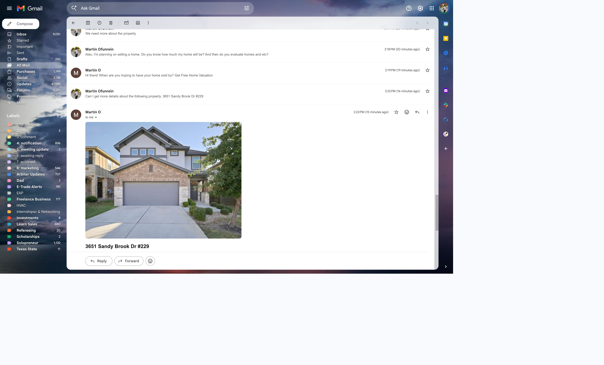
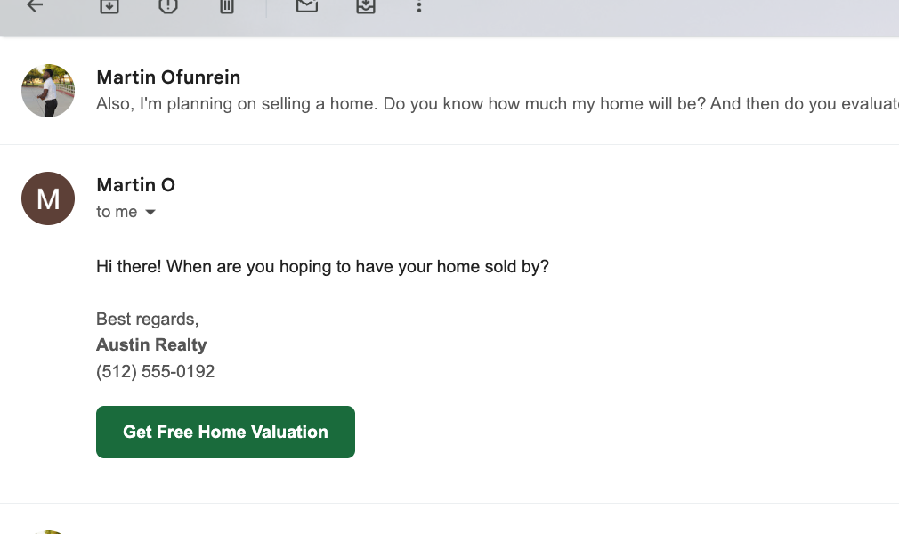

# Real Estate Email Agent

[](https://github.com/Ofunrein/real-estate-email-agent/actions/workflows/build-check.yml)

Real Estate Email Agent is the Lumenosis real estate automation app. It started as **Iris**, a Gmail agent for real estate teams, and grew into an omnichannel lead-handling system around that same email-first brain.

The main product is still the Gmail/Agent Inbox workflow: Iris reads real estate emails, understands the lead, searches property context, drafts or sends a useful reply, and keeps the team in control. The newer SMS, Instagram, Messenger, WhatsApp, voice, and website-chat paths are channel adapters around that same core memory, property search, and handoff system.

The current demo client is **Austin Realty**. Runtime config, seeded database rows, channel connections, and RAG embeddings should use `CLIENT_ID=austin-realty`.

Customer replies use Claude. Property RAG uses OpenAI only for embeddings, stored in Neon Postgres with `pgvector`.

---

## What this project became

This repo is no longer just a local Gmail script. It is now a hosted omnichannel real estate agent platform.

The easiest way to understand it:

| Part | What it means |
|---|---|
| Main product | Iris Gmail agent plus Agent Inbox for reviewing leads, replies, memory, and handoffs |
| Core job | Respond fast to real estate leads with accurate property context and safe escalation |
| Omnichannel layer | Lets the same lead brain handle SMS, Instagram, Messenger, WhatsApp, voice, and website chat |
| Memory layer | Stores every lead, message, summary, and handoff in Neon so channels do not operate in isolation |
| Property layer | Combines structured SQL filters, live/imported listings, and vector search for natural property requests |
| Human-control layer | Draft-first email, needs-human categories, thread takeover, audit logs, and dashboard visibility |

The product direction is: **Gmail inbox agent first, omnichannel real estate front desk second**. Email is the anchor because real estate teams already work out of their inbox. The extra channels exist so the same conversation can continue wherever the lead replies.

---

## Product evolution

The project has three generations in one repo:

| Generation | What existed | Status now |
|---|---|---|
| 1. Local Gmail agent | `agent.py` polled Gmail, classified emails, searched property data, and replied | Still present as legacy compatibility |
| 2. Hosted Iris inbox | Next.js/Vercel app, Gmail OAuth, Gmail push webhooks, Inngest background processing, Agent Inbox UI | Main production path |
| 3. Omnichannel handling | SMS, WhatsApp, Instagram/Messenger, website chat, and voice routes that share Iris memory and property logic | Active channel layer around the email-first product |

This matters when reading the code:

- Older files may say `Theo`, `Aria`, or `Olivia` because those were channel-specific names while the product was expanding.
- Iris is the real product identity and shared assistant personality.
- Route names are kept stable because Twilio, Meta, Vapi, Gmail, and other external systems already point to those URLs.
- The business logic should keep moving into shared modules so each channel is just a transport, not a separate agent.

---

## What the app does

The app receives messages from real estate leads, decides what the lead wants, looks up the right context, and responds through the same channel.

| Lead asks for | What happens |
|---|---|
| A specific property | Finds the matching property, adds useful facts, and replies with details and links |
| A broad search | Uses SQL filters for hard facts like price, beds, baths, city, and ZIP, then RAG/vector search for softer wording like "modern kitchen" or "good natural light" |
| Photos | Sends safe public image links or falls back to a listing/gallery URL |
| A showing | Routes to booking flow, calendar tools, or human handoff depending on channel state |
| A call | Flags handoff or voice follow-up |
| Seller valuation | Qualifies the seller and routes to valuation CTA or human follow-up |
| Confusing, risky, or high-intent message | Marks the thread for human review instead of forcing an unsafe auto-reply |

All channels write to the same Neon tables, so email, SMS, Instagram, Messenger, WhatsApp, voice, and website chat can share memory.

---

## Channels

The channel layer is deliberately thin. Its job is to translate each provider into the same internal shape: who sent it, which thread it belongs to, what the message says, what media came with it, and whether the app is allowed to respond.

| Channel | Current route | Notes |
|---|---|---|
| Gmail / email | `/api/webhooks/iris-gmail-push` | Hosted Gmail push enters a durable Inngest flow |
| SMS | `/api/webhooks/theo-sms` | Twilio inbound SMS/RCS route |
| WhatsApp | `/api/webhooks/theo-whatsapp` | Meta WhatsApp Cloud API route |
| Instagram / Messenger | `/api/webhooks/theo-meta-social` | Direct Meta social webhook route |
| Website chat | `/api/webhooks/olivia-website` | Logs website/chat intake and can trigger SMS when consent is present |
| Voice | `/api/webhooks/aria-voice` | Vapi/voice events and call summaries |

Every successful inbound/outbound turn should create rows in `conversation_events` and update `lead_memory` when the contact identity is known.

The intended behavior is not "six separate bots." It is one Iris system with multiple doors:

- Gmail is the primary workflow for business-critical replies and human review.
- SMS is for fast lead response, showing coordination, and short follow-ups.
- Instagram and Messenger catch social DMs and route them into the same memory.
- WhatsApp mirrors the same Theo/Iris SMS-style logic through Meta Cloud API.
- Voice handles phone calls and call summaries while reading the same lead context.
- Website chat captures web leads and can start SMS follow-up when consent exists.

---

## Screenshots

**Live Zillow search results** - "show me 3-bed homes under $500k in Round Rock":


**Property detail reply** - photo, price, beds/baths/sqft, mortgage rates, Calendly button:



**Seller lead qualification** - asks one question + free home valuation CTA:



---

## Documentation

Start here rather than reading this README end to end.

| Doc | What it covers |
|---|---|
| **[docs/DEVELOPER_SETUP.md](docs/DEVELOPER_SETUP.md)** | Clean-clone setup with no third-party credentials: prerequisites, safe env template rules, local Postgres + pgvector, expected command output, verification curls, and a troubleshooting index |
| **[docs/ARCHITECTURE.md](docs/ARCHITECTURE.md)** | How the live system works: the Gmail push → Inngest runtime, data flow, channel boundaries, storage and schema, property retrieval/RAG, reliability, security, multi-tenancy, deployment, and the design decisions behind each |
| **[docs/CRM_INTEGRATION.md](docs/CRM_INTEGRATION.md)** | The `CrmAdapter` contract, per-provider support (GHL live; FUB/kvCORE partially stubbed), all 31 catalogued CRMs, event mirroring via `npm run sync:ghl`, and how to add an adapter |
| [docs/iris-email-stress-workflow.md](docs/iris-email-stress-workflow.md) | Adding email scenarios and verifying a live Gmail round trip |
| [docs/proof/iris-email-scenarios.md](docs/proof/iris-email-scenarios.md) | Recorded output of `npm run proof` |
| [docs/decisions/](docs/decisions) | Dated design decisions, including why `agent.py` is deprecated |

New here? [docs/DEVELOPER_SETUP.md](docs/DEVELOPER_SETUP.md) gets you to a running dashboard, then [docs/ARCHITECTURE.md](docs/ARCHITECTURE.md) explains what you are looking at.

---

## Architecture

Full detail, including failure behavior and design rationale, is in **[docs/ARCHITECTURE.md](docs/ARCHITECTURE.md)**. The summary below is the mental model.

The simplest mental model:

```text
Lead message
  -> channel adapter
  -> shared Iris brain
  -> Neon memory + property context + RAG
  -> Claude reply
  -> channel sender
  -> Agent Inbox visibility
```

For Gmail, the flow is:

```text
Gmail push notification
  -> /api/webhooks/iris-gmail-push
  -> Inngest durable job
  -> load Gmail thread + lead memory + property context
  -> Iris classifies the message
  -> draft, auto-send, label, or human-review decision
  -> write conversation_events + lead_memory + ai_drafts
  -> show the result in Agent Inbox
```

For non-email channels, the flow is:

```text
Twilio / Meta / Vapi / website payload
  -> channel webhook
  -> normalize sender, thread, message, media, and consent
  -> load shared lead memory and recent cross-channel history
  -> search properties when needed
  -> generate a channel-sized Claude reply
  -> send through the provider when enabled
  -> write the same Neon event timeline used by email
```

Important pieces:

| Layer | Main files | Purpose |
|---|---|---|
| Gmail product core | `lib/irisEmail.ts`, `lib/inngest/functions/gmailPushReceived.ts` | Iris email classification, draft/send behavior, labels, thread state, durable hosted Gmail processing |
| Agent Inbox | `app/page.tsx`, `app/api/data/route.ts`, inbox APIs under `app/api/threads/*` | Operator view for leads, channels, drafts, categories, takeovers, and message history |
| Channel adapters | `app/api/webhooks/*/route.ts` | Receives SMS, WhatsApp, Meta social, voice, website, and Gmail push events |
| Shared memory | `lib/database.ts` | Reads/writes clients, properties, lead memory, events, settings, channels, drafts, and audit rows |
| Property retrieval | `lib/propertyRetrieval.ts` | Shared SQL plus optional vector retrieval for property candidates |
| Embeddings | `lib/propertyEmbeddings.ts` | Builds property text and calls OpenAI embeddings |
| Inngest jobs | `lib/inngest/functions/*` | Durable background processing for hosted Gmail |
| Backfill scripts | `scripts/*` | Imports, syncs, migrations, RAG backfill, channel tests |
| Tests | `tests/ts/*` | TypeScript unit and integration-style checks |

Some route names still say Theo, Aria, or Olivia because vendors already point to those URLs. The runtime personality should be Iris/Austin Realty unless a specific compatibility path says otherwise.

---

## Database

Neon Postgres is the system of record.

Core tables:

| Table | Purpose |
|---|---|
| `clients` | One row per client tenant. Demo client: `austin-realty` |
| `properties` | Structured property catalog |
| `property_embeddings` | Vector embeddings for RAG property matching |
| `lead_memory` | Contact-level memory and qualification state |
| `conversation_events` | Timeline of inbound/outbound messages across channels |
| `channel_connections` | Connected Instagram, Messenger, Gmail, and other channel accounts |
| `email_accounts` | Hosted Gmail mailbox tokens |
| `inbox_settings` / `inbox_categories` | Agent Inbox behavior and review categories |
| `request_audit_events` | Webhook/audit trail for debugging live traffic |

Run migrations with your loaded `DATABASE_URL`:

```bash
for migration in db/migrations/*.sql; do
  psql "$DATABASE_URL" -f "$migration"
done
```

The RAG migration is:

```text
db/migrations/023_property_embeddings.sql
```

---

## Property RAG

RAG is implemented directly in Neon, not LangChain and not a separate vector database.

Why:

- Property data already lives in Postgres.
- SQL is better for exact filters like price, beds, baths, city, ZIP, and status.
- Vector search is useful for fuzzy language like "cozy", "open concept", "lots of natural light", or "good for entertaining".
- Keeping both in Neon avoids syncing live property data to a second database.

Activation checklist:

```bash
# 1. Apply db/migrations/023_property_embeddings.sql

# 2. Backfill embeddings for the active client
CLIENT_ID=austin-realty npm run rag:backfill -- --limit=5000 --batch=96

# 3. Enable runtime retrieval
PROPERTY_RAG_ENABLED=true
```

Backfill uses `OPENAI_API_KEY` or `PROPERTY_EMBEDDING_OPENAI_API_KEY` for `text-embedding-3-small`. Customer-facing replies still use Claude.

At runtime:

- Exact address lookup stays deterministic.
- Candidate property searches call `retrievePropertiesForAgent(...)`.
- Voice skips RAG by default for latency unless explicitly enabled later.
- If `PROPERTY_RAG_ENABLED` is not `true`, the app falls back to normal SQL/property rows.

---

## Local setup

For a step-by-step clean-clone walkthrough with expected output, database setup, verification, and troubleshooting, use **[docs/DEVELOPER_SETUP.md](docs/DEVELOPER_SETUP.md)**. The short version:

Install dependencies:

```bash
npm install
```

Copy and fill environment variables:

```bash
cp .env.example .env
```

Minimum local variables for the hosted TypeScript app:

```bash
DATABASE_URL=
CLIENT_ID=austin-realty
CLIENT_NAME="Austin Realty"
TEAM_NAME="Austin Realty"
EMAIL_ACCOUNT_CLIENT_ID=austin-realty
PUBLIC_BASE_URL=http://127.0.0.1:3000
AUTH_URL=http://127.0.0.1:3000
ANTHROPIC_API_KEY=
OPENAI_API_KEY=
PROPERTY_RAG_ENABLED=true
```

Start the Next.js app:

```bash
npm run dev
```

Open:

```text
http://127.0.0.1:3000
```

---

## Environment groups

Most configuration lives in `.env` locally and Vercel project env vars in production.

| Group | Key examples | Used for |
|---|---|---|
| Client | `CLIENT_ID`, `CLIENT_NAME`, `TEAM_NAME` | Branding and tenant routing |
| Database | `DATABASE_URL`, `DATABASE_SSL` | Neon reads/writes |
| Claude | `ANTHROPIC_API_KEY`, Claude model vars | Customer-facing classification and replies |
| Embeddings | `OPENAI_API_KEY`, `PROPERTY_EMBEDDING_OPENAI_API_KEY`, `PROPERTY_RAG_ENABLED` | Property vector search |
| Gmail | `GMAIL_OAUTH_CLIENT_ID`, `GMAIL_OAUTH_CLIENT_SECRET`, `EMAIL_ACCOUNT_ENCRYPTION_KEY` | Hosted mailbox connection |
| Twilio | `TWILIO_ACCOUNT_SID`, `TWILIO_AUTH_TOKEN`, `TWILIO_FROM`, `TWILIO_MESSAGING_SERVICE_SID` | SMS/RCS send and receive |
| Meta | `META_SOCIAL_WEBHOOK_VERIFY_TOKEN`, `META_SOCIAL_APP_SECRET`, `META_SOCIAL_PAGE_ACCESS_TOKEN` | Instagram and Messenger direct webhooks |
| WhatsApp | `WHATSAPP_PHONE_NUMBER_ID`, `WHATSAPP_ACCESS_TOKEN`, `WHATSAPP_WEBHOOK_VERIFY_TOKEN` | WhatsApp Cloud API |
| Voice | `VAPI_API_KEY`, `VAPI_*`, `ARIA_*` | Voice assistant provisioning and callbacks |

Do not commit real secrets. Plain client flags like `CLIENT_ID=austin-realty` are safe, but API keys and tokens are not.

---

## Gmail setup

Hosted Gmail uses an OAuth mailbox connection that can be different from the dashboard login account.

Google OAuth redirect URI:

```text
https://app.lumenosis.com/api/settings/email-account/callback
```

Set:

```bash
GMAIL_OAUTH_CLIENT_ID=
GMAIL_OAUTH_CLIENT_SECRET=
EMAIL_ACCOUNT_ENCRYPTION_KEY=
EMAIL_ACCOUNT_CLIENT_ID=austin-realty
```

Hosted Gmail push enters:

```text
/api/webhooks/iris-gmail-push
```

The durable processor is the Inngest function:

```text
gmail.push.received
```


---

## Instagram and Messenger

Direct Meta social mode is controlled by:

```bash
ENABLE_META_SOCIAL_WEBHOOKS=true
ENABLE_INSTAGRAM_DIRECT_WEBHOOK=true
ENABLE_MESSENGER_DIRECT_WEBHOOK=true
META_SOCIAL_WEBHOOK_VERIFY_TOKEN=
META_SOCIAL_APP_SECRET=
META_SOCIAL_PAGE_ACCESS_TOKEN=
ENABLE_SOCIAL_DM_AGENT=true
```

Meta webhook URL:

```text
https://app.lumenosis.com/api/webhooks/theo-meta-social
```

Expected checks:

- `GET` verification returns the Meta challenge when the verify token matches.
- `POST` requests pass `x-hub-signature-256` when the app secret is set.
- Inbound messages write `conversation_events` under `client_id='austin-realty'`.
- The channel connection is present in `channel_connections`.

---

## Media and screenshot understanding

All text channels should treat media as conversation context, not noise. Shared screenshots, property photos, reels, videos, and voice notes are normalized into `media_json`, enriched by `lib/mediaUnderstanding.ts`, then folded into the message text sent to the shared agent brain.

Covered inbound paths:

| Channel | What happens |
|---|---|
| Email | Gmail non-text attachments become media records. If the file can be downloaded, image bytes can be sent to Claude vision when enabled. Otherwise the agent still gets safe heuristic context. |
| SMS/MMS | Twilio media URLs and voice-note transcripts are attached to the inbound event before Theo replies. |
| WhatsApp | Meta media IDs are resolved, proxied, understood, then kept in `conversation_events.media_json`. |
| Instagram/Messenger | Meta shared attachments, image/video/reel links, and transcribed media route through the same media-understanding path. |
| Composio/social fallback | Polled social messages use the same media enrichment before dedupe and reply. |

Enable real image analysis:

```bash
ENABLE_MEDIA_VISION=true
MEDIA_VISION_MODEL=claude-sonnet-4-6
ANTHROPIC_API_KEY=
```

If vision is off or media is inaccessible, the system still gives the agent a safe summary like “lead shared social content” or “lead sent kitchen inspiration photo” and asks one concise clarifying question instead of pretending it saw details. This is deliberate for real estate compliance and reliability.

Scenario handling lives in `lib/conversationPlaybooks.ts`. It recognizes seller valuation, buyer listing details, broad property search, showing scheduling, shared media references, service-area checks, and missing lead-profile details. The playbook is injected into Theo/Iris context so SMS, WhatsApp, Instagram, Messenger, website chat, and email use the same business judgment.

---

## Facebook Lead Ads and speed-to-lead

Facebook Lead Form submissions enter through:

```text
/api/webhooks/meta-leadgen
```

Meta sends a `leadgen_id`; the app fetches field data, normalizes it into the shared lead/event model, dedupes it, writes `lead_memory` + `conversation_events`, then optionally sends an instant Austin Realty SMS if phone/consent exists.

Env:

```bash
META_LEADGEN_VERIFY_TOKEN=
META_LEADGEN_ACCESS_TOKEN=
META_LEADGEN_AUTOREPLY=true
```

Important rule: Facebook Lead Form data is not the same as Messenger/Instagram DM identity. If a lead form only provides phone/email, first reply should be SMS or email. Reply in Messenger/Instagram only when the lead actually came through a click-to-message path with a real thread ID.

Provider-neutral forms, CRM automations, Make, n8n, valuation pages, listing pages, and QR flows can enter through:

```text
POST /api/webhooks/lead-capture
Authorization: Bearer <LEAD_CAPTURE_WEBHOOK_SECRET or CHANNEL_WEBHOOK_SECRET>
Idempotency-Key: <stable external event id>
```

The payload carries `provider`, `source_type`, lead identity, campaign, clicked property, behavior, message, and consent. Iris stores that acquisition context before the shared reply decision runs. RentCast enrichment is intentionally excluded because current usage cost is too high.

---

## Persistent cadence

Cadence is stateful, not prompt-only. The agent records facts. The cadence engine decides when to follow up, pause, stop, or escalate.

Core pieces:

| Piece | File/table | Purpose |
|---|---|---|
| Rules | `lib/cadence.ts`, `lib/cadenceQueue.ts` | Max touches, reply stop, quiet hours, one-channel-per-day, consent checks |
| Scheduler | `lib/cadenceScheduler.ts` | Creates durable follow-up tasks after inbound/outbound events |
| Storage | `cadence_tasks` table, migration `024_cadence_tasks.sql` | Durable GHL-style follow-up queue |
| Workers | `cadence-plan`, `cadence-task-run` Inngest functions | Plan and execute due follow-up tasks |

Env:

```bash
ENABLE_CADENCE_TASKS=true
CADENCE_MAX_TOUCHES=14
CADENCE_MIN_GAP_HOURS=48
CADENCE_STOP_ON_REPLY=true
CADENCE_ONE_CHANNEL_PER_DAY=true
CADENCE_TASK_BATCH_SIZE=10
```

Stop/hold rules: if the lead replies, opts out, books, needs human review, or has a channel disabled, cadence must not blindly continue. Blocked/sent/skipped state is stored so the dashboard and Ops Log can explain what happened.

---

## Advanced buyer and seller qualification

All channels use the same qualification logic, including voice. The goal is not to interrogate leads; it is to naturally collect the missing fields needed to help them and move toward a real next step.

Shared playbook lives in:

```text
lib/qualificationPlaybooks.ts
lib/conversationPlaybooks.ts
```

It is injected into:

| Agent/path | Coverage |
|---|---|
| Theo text brain | SMS, WhatsApp, Instagram, Messenger, website chat |
| Iris email brain | Email replies and Gmail-driven lead memory |
| Aria voice brain | Inbound/outbound calls and Vapi tool flow |
| Voice `qualifyLead` tool | Persists role, budget, area, timeline, beds, baths, sell-before-buy, property interest, consent, preferred channel |

Qualification rules:

- General: identify buying, selling, both, renting, investing, or value-checking.
- Seller: capture property address, Realtor/representation status, timeline, motivation, updates/renovations, condition, occupancy/access, and whether they also need to buy.
- Buyer: capture area, budget, beds/baths, property type, must-haves, timeline, financing/pre-approval status without giving lending advice, and whether they need to sell first.
- Dual move: if someone says they are selling one home and moving/buying elsewhere, keep both tracks active. Example: value the current property and help with the destination search.
- Realtor guard: if a seller already has a Realtor or listing agreement, do not solicit. Give safe general info only and route sensitive/representation questions to a human.
- Appointment rule: checking openings is not booking. Do not say an appointment is scheduled until the booking/calendar tool confirms.

Example CloseBot-style path now expected across text and voice:

```text
Lead: My wife and I are moving to the area and selling our place in Lancaster.
Agent: I can help with both selling your Lancaster home and your new search. Are you already working with a Realtor, or still looking at options?
Lead: 120 Savo Ave, Lancaster PA. We are interviewing Realtors.
Agent: Based on the address, I can start a valuation. Have you made any major updates or renovations since buying it? Also, where are you planning to move?
Lead: Akron area.
Agent: Got it. I can help with the Akron search too. I have openings tomorrow between 8:00 AM and 4:30 PM. What time works best for you and your wife?
```
---

## GoHighLevel / CloseBot-style actions

Adapter contract, per-provider support, and the event-mirroring script are documented in **[docs/CRM_INTEGRATION.md](docs/CRM_INTEGRATION.md)**.

The app can sit beside GoHighLevel the same way a CloseBot-style agent does: GHL can trigger Lumenosis, Lumenosis reads the real omnichannel timeline, then writes useful state back to the contact.

Implemented custom action:

| Action | Endpoint | What it does |
|---|---|---|
| Summarize Conversation | `POST /api/actions/summarize-conversation` | Reads `conversation_events` across email, SMS, WhatsApp, Instagram, Messenger, website chat, and voice, builds one Austin Realty summary, and can save it into a GHL contact custom field |

GHL workflow/custom-action example:

```json
{
  "contactId": "{{contact.id}}",
  "phone": "{{contact.phone}}",
  "email": "{{contact.email}}",
  "fullName": "{{contact.name}}",
  "writeToCrm": true
}
```

Headers:

```text
Authorization: Bearer <CHANNEL_WEBHOOK_SECRET>
```

Optional env vars:

```bash
GHL_CONVERSATION_SUMMARY_FIELD_ID=
GHL_CONVERSATION_SUMMARY_FIELD_KEY=conversation_summary
CLOSEBOT_PARITY_CUSTOM_ACTION_SECRET=
```

Use `GHL_CONVERSATION_SUMMARY_FIELD_ID` when the exact GHL custom field ID is known. Otherwise the adapter sends the configured key. If `writeToCrm` is false, the endpoint only returns the summary JSON and does not write to GHL.

This is the first CloseBot-parity action. The broader model is:

```text
GHL trigger or lead form
  -> Lumenosis action/webhook
  -> shared lead memory + conversation_events
  -> AI summary / reply / booking / handoff
  -> optional GHL contact, custom field, calendar, conversation, tag, or workflow update
```
---

## SMS testing

Local Theo SMS test:

```bash
npm run theo:test -- "I want to tour 12400 Cedar St" "+15128152032"
```

Live Twilio setup helper:

```bash
npm run theo:twilio:configure
```

Important flags:

```bash
ENABLE_SMS_AGENT=false          # keep false for dry runs
ENABLE_SMS_IMAGES=false         # optional MMS/RCS property photos
SMS_IMAGE_MODE=on_request       # off | on_request | property_reply
SMS_MAX_IMAGES=3
THEO_REPLY_DEBOUNCE_MS=2500
THEO_ENRICHMENT_TIMEOUT_MS=14000
THEO_APIFY_TIMEOUT_SECONDS=12
```

Do not use reserved `+1555...` numbers for live Twilio smoke tests. The app blocks test-like NANP numbers to avoid bad sends and noisy dashboard rows.

---

## Sync and imports

Google Sheets can still be used as an editable property source.

```bash
npm run sync:sheets
```

Other useful jobs:

```bash
npm run setup:neon
npm run sync:ghl
npm run import:zillow
npm run normalize:rental-prices
npm run rag:backfill -- --limit=5000 --batch=96
```

Current sync contract:

- Google Sheets can seed/update Neon property rows.
- Live property lookups can write to Neon and append missing rows back to Sheets when configured.
- Broad Neon-to-Sheets overwrite is not automatic yet because the sheet needs row-level conflict markers first.

---

## Testing and proof of execution

| Check | Command | Scope |
|---|---|---|
| TypeScript tests | `npm test` | 510 tests across 76 files in [`tests/ts/`](tests/ts) — classification, reply rendering, webhook security, rate limits, tenant isolation, provider adapters |
| Python tests | `npm run test:py` | 93 tests across 17 files in [`tests/`](tests) — sheet schema, channel webhook contracts, lead memory, property hygiene |
| Type check / lint | `npm run lint` | `tsc` over the whole project |
| Secret scan | `npm run security:scan` | Runs automatically in `prebuild` |
| Agent proof run | `npm run proof` | Replays 8 real email scenarios end-to-end through the live classifier and reply renderer |
| Production build | `npm run build` | Next.js build |

Run everything the way CI does:

```bash
npm run lint
npm test
npm run test:py
npm run proof
npm run build
```

Run a single test file:

```bash
node --import tsx --test tests/ts/irisEmail.test.ts
python3 -m pytest tests/test_sheet_schema.py -v
```

Python tests cover the legacy Python paths and the cross-runtime contracts (sheet schema and webhook route shapes) that the TypeScript runtime must keep honoring, so run them when you touch either side.

**Direct proof of execution:** [`docs/proof/iris-email-scenarios.md`](docs/proof/iris-email-scenarios.md) is the recorded output of `npm run proof`, committed to the repo. It replays the scenarios in [`tests/fixtures/iris-email-stress-scenarios.json`](tests/fixtures/iris-email-stress-scenarios.json) through `isIrisEligibleEmail` -> `classifyIrisEmailText` -> `decideIrisEmailExecution` -> `generateIrisEmailReply`, and shows the intent, next action, auto-reply decision, and Gmail label the agent picks for each one — including the fair-housing and unsubscribe cases that must route to a human instead of auto-replying.

The run is offline and deterministic: no network calls, no API keys, no customer data. CI regenerates the artifact and fails on `git diff --exit-code` if it no longer matches committed behavior, so the file cannot silently rot.

See [`docs/iris-email-stress-workflow.md`](docs/iris-email-stress-workflow.md) for how scenarios are added and how a live Gmail round-trip is verified after deploy.

---

## CI and build status

[](https://github.com/Ofunrein/real-estate-email-agent/actions/workflows/build-check.yml)

Every push and pull request to `main` runs [`.github/workflows/build-check.yml`](.github/workflows/build-check.yml) on Node 22 and Python 3.12, in this order:

1. Reject internal registry URLs in `package-lock.json` (they break Vercel installs).
2. `npm ci` and `pip install -r requirements.txt pytest`.
3. `npm run lint`.
4. `npm test` — TypeScript suite.
5. `npm run test:py` — Python suite.
6. `npm run proof` — deterministic agent proof run.
7. `git diff --exit-code docs/proof/iris-email-scenarios.md` — fails if the recorded proof output is stale.
8. `npm run build`.

`prebuild` runs the secret scan and type check before every build, locally and in CI, so a build cannot ship a committed credential.

---

## Deployment

Production app:

```text
https://app.lumenosis.com
```

Vercel project env must include:

```bash
CLIENT_ID=austin-realty
CLIENT_NAME=Austin Realty
TEAM_NAME=Austin Realty
EMAIL_ACCOUNT_CLIENT_ID=austin-realty
PROPERTY_RAG_ENABLED=true
```

After changing Vercel env vars, deploy again so serverless functions receive the new values:

```bash
vercel deploy --prod
```

---

## Common debugging queries

Check recent channel activity:

```sql
select channel, count(*) as events, max(created_at) as latest
from conversation_events
where client_id = 'austin-realty'
group by channel
order by latest desc;
```

Check connected channels:

```sql
select channel, provider, status, selected_asset_name, updated_at
from channel_connections
where client_id = 'austin-realty'
order by updated_at desc;
```

Check RAG coverage:

```sql
select client_id, count(*) as vectors
from property_embeddings
group by client_id;
```

Check latest webhook audit events:

```sql
select route, channel, provider, outcome, status_code, created_at
from request_audit_events
where client_id = 'austin-realty'
order by created_at desc
limit 25;
```

---

## Legacy Python agent

The older Python email poller still exists for compatibility:

```bash
python agent.py
```

Modern hosted work should prefer the TypeScript/Vercel path. Keep Python changes scoped unless you are explicitly working on the legacy poller.

---

## Project rules

- Austin Realty is the active demo client.
- Keep channel logic centralized in shared agent modules instead of duplicating business logic inside Twilio, Meta, or Vapi builders.
- Use SQL for exact constraints and RAG for semantic property matching.
- Keep image/media links real and public before sending them through SMS, WhatsApp, or social DMs.
- Prefer durable processing for hosted Gmail and other work that must survive a serverless response ending.
- Do not add LangChain unless there is a concrete provider orchestration problem that the direct adapters cannot handle.
